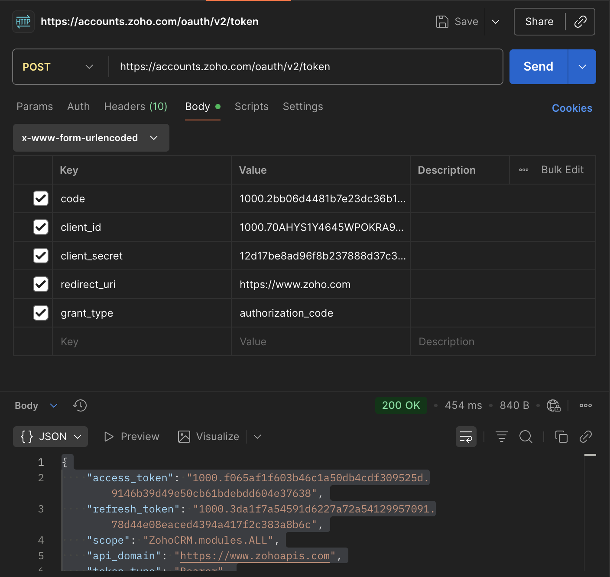

## Zoho Auth linking:

STEP1: Get credentials

STEP2: Get access tokens

STEP3: 

https://www.zoho.com/accounts/protocol/oauth/js-apps/access-token.html

ZOHO API COnsole/ developer console:

```
Client ID: 1000.KQMVSYBA285IQLM88F4QOK653X5VQH
Client Secret: 7b40415bcaac78b1c0ce54f8bdeb47e09d00b3cdff

```

API Console → your Self Client → **Generate Code** → scopes (see below) → **Create** → copy the code.

Scope:  ZohoSign.documents.ALL, ZohoSign.templates.ALL

grant code: 1000.cd350fd1f534ce0dd3645588e946be69.7d78e2537c3bfaa94bc32e4955b5a5d8

**Exchange the code for tokens** (no `redirect_uri` needed for Self Client):

POST https://accounts.zoho.com/oauth/v2/token
  -d "client_id=<YOUR_CLIENT_ID>"
  -d "client_secret=<YOUR_CLIENT_SECRET>"
  -d "grant_type=authorization_code"
  -d "code=<GRANT_CODE_FROM_CONSOLE>"

OAuth SCope:

Postman:

Refresh Tocken:


POST - https://accounts.zoho.com/oauth/v2/token

{

"access_token":"1000.8c25a54d906ec3ac26f7bc50354e3601.2165863151b3b32ea90658e2ddb30998",

"refresh_token":"1000.3b2a7ab388da05dda24fcc00dac8ee6d.4b47f7774434a917a70e2a9d788f0623",

"scope":"ZohoSign.documents.ALL ZohoSign.templates.ALL",

"api_domain":"https://www.zohoapis.com",

"token_type":"Bearer",

"expires_in":3600

}

### Error undertanding:

Zoho - https://www.zoho.com/sign/api/error-codes.html

### Errors encountered:

Cheking if account exits:

```
if regarding account
scope: ZohoSign.documents.ALL,ZohoSign.templates.ALL, ZohoSign.account.READ,aaaserver.profile.read
curl -s -H "Authorization: Zoho-oauthtoken <access_tocken>" \  https://accounts.zoho.com/oauth/user/infoOutput: https://accounts.zoho.com/oauth/user/info

#both api developer and e-sign profiles should be created with this email

```


```
{"code":8026,"message":"Upgrade your Zoho Sign license.","status":"failure"}
```

oct 28: working code 

```
curl --location 'https://sign.zoho.com/api/v1/requests' \
--header 'Authorization: Zoho-oauthtoken 1000.2bf5fd59292441ad0f11f0232c83c497.947a35df321df2a7a45cb98c5afd3d59' \
--form 'file=@src/app/Divya_Resume_amazon.pdf' \
--form 'data={
    "requests": {
        "request_name": "NDA",
        "description": "Details of document",
        "is_sequential": true,
        "actions": [
            {
                "action_type": "SIGN",
                "recipient_email": "dbojanki@asu.edu",
                "recipient_name": "Divya Sri Sai Bojanki",
                "signing_order": 0,
                "verify_recipient": true,
                "verification_type": "EMAIL",
                "private_notes": "To be signed"
            },
            {
                "action_type": "INPERSONSIGN",
                "recipient_email": "dbojanki@asu.edu",
                "recipient_name": "Divya Sri Sai Bojanki",
                "in_person_name": "Divya",
                "in_person_email": "dbojanki@asu.edu",
                "signing_order": 1,
                "verify_recipient": false,
                "private_notes": "Sign as Inperson"
            }
        ],
        "expiration_days": 10,
        "email_reminders": true,
        "reminder_period": 2,
        "notes": "Note for all recipients"
    }
}' 
```

### Tailwand CSS:

#### Text:

* `text-xs`: 0.75rem (12px)
* `text-sm`: 0.875rem (14px)
* `text-base`: 1rem (16px) - This is the default browser font size.
* `text-lg`: 1.125rem (18px)
* `text-xl`: 1.25rem (20px)
* `text-2xl`: 1.5rem (24px)
* `text-3xl`: 1.875rem (30px)
* `text-4xl`: 2.25rem (36px)
* `text-5xl`: 3rem (48px)
* `text-6xl`: 3.75rem (60px)
* `text-7xl`: 4.5rem (72px)
* `text-8xl`: 6rem (96px)
* `text-9xl`: 8rem (128px)

#### Horizontal Centering and Vertical Centering:

```
<div class="flex justify-center">
      <div>Centered Item</div>
</div>


 <div class="flex justify-center items-center h-screen">
    <div>Centered Item</div>
 </div>

 <div class="flex justify-center items-center h-screen">
    <div>Centered Item</div>
 </div>
```

#### Padding:

* Padding on all sides:  `p-{size}`
* Padding on specific sides: `pt-{size}`, `pr-{size}`, `pb-{size}`, and `pl-{size}`
* Horizontal and vertical padding: `px-{size}` and `py-{size}`
